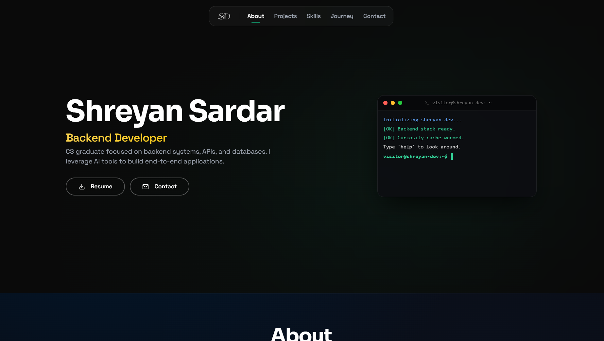

# ShreyanDev | Portfolio Website

A personal developer portfolio website showcasing my backend engineering skills and full-stack projects.

## 🚀 Tech Stack

- **Frontend**: React 18, TypeScript, Vite
- **Styling & Animation**: Tailwind CSS, Framer Motion
- **Icons & Routing**: Lucide React, React Icons, React Router DOM
- **AI Tools**: Lovable, Cursor, GitHub Copilot, Antigravity

## ✨ Core Features

- **Terminal Mockup**: Interactive CLI simulator to query my bio, projects, and contact info.
- **Project Showcase**: Cards showing projects with links, details, and demo login credentials.
- **Journey Timeline**: Chronological list of my education, milestones, and work history.
- **Contact Info**: Social and email links.
