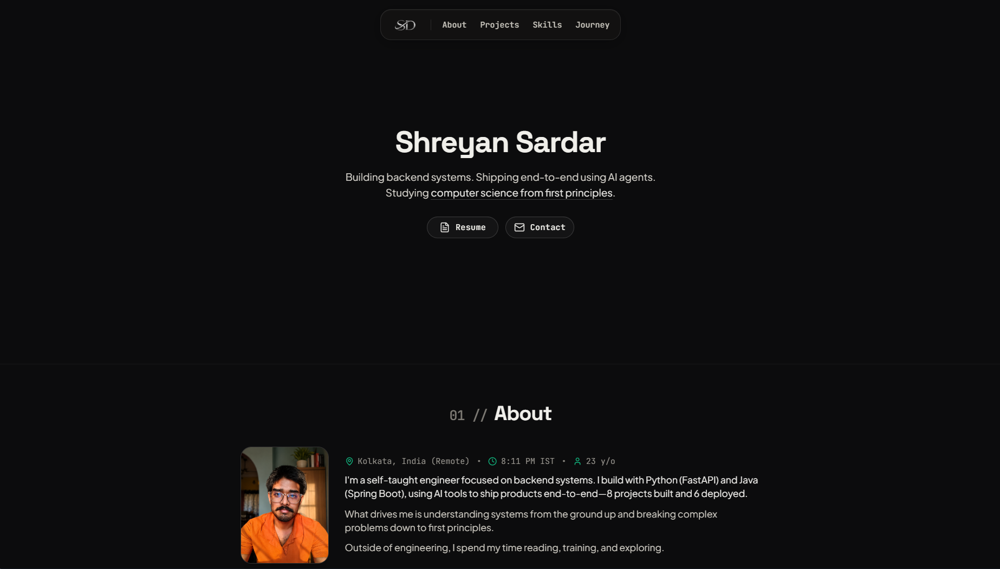

# &nbsp;&nbsp;ShreyanDev

Personal developer portfolio and interactive terminal simulator showcasing full-stack applications, system architecture breakdowns, and technical milestones.

[](https://shreyandev.vercel.app)

---

## Preview

| Portfolio Overview |
| :---: |
|  |

---

## Features

- **Interactive Terminal Simulator**: Execute in-browser CLI commands to query developer bio, project technical specifications, and quick links.
- **Curated Project Showcase**: Dynamic project cards highlighting architecture breakdowns, live deployment links, test credentials, and GitHub repositories.
- **Milestone Timeline**: Chronological interactive tracker mapping academic history, software releases, and technical milestones.
- **Live Contribution Graph**: Real-time GitHub commit history and activity matrix fetched dynamically via serverless edge functions.
- **In-App Document Viewer**: Embedded PDF modal allowing instant viewing and downloading of resume and course certifications directly in the viewport.

---

## Tech Stack

- **Frontend**: React 18, TypeScript, Vite, Tailwind CSS, Framer Motion, Lucide Icons
- **Backend & Edge**: Vercel Edge Functions
- **Deployment**: Vercel
- **AI Tooling**: Antigravity, Cursor

---

## Project Structure

```text
shreyan-dev/
├── api/                    # Vercel Edge serverless API routes (GitHub contribution scraper)
├── public/                 # Static assets, project preview images, and PDF documents
├── src/
│   ├── components/         # Modular React UI sections (Hero, Terminal, Projects, Github, etc.)
│   │   └── ui/             # Reusable UI primitives
│   ├── data/               # Project metadata, timeline milestones, and terminal commands
│   ├── lib/                # Shared utilities and class helpers
│   ├── pages/              # View pages (Index, NotFound)
│   ├── App.tsx             # Root application component & routing
│   ├── index.css           # Global typography and Tailwind directives
│   └── main.tsx            # Application entry point
├── index.html              # HTML shell & metadata
├── package.json            # Project dependencies and npm scripts
├── tailwind.config.ts      # Tailwind CSS configuration
├── vercel.json             # Vercel deployment routes and headers configuration
└── vite.config.ts          # Vite build configuration
```

---

## Getting Started

### Prerequisites

- **Node.js**: `v18.0.0` or higher (recommended: `v20+`)
- **npm**: `v9.0.0` or higher

### Local Development

1. **Clone the repository:**
   ```bash
   git clone https://github.com/ShreyanDev5/shreyan-dev.git
   cd shreyan-dev
   ```

2. **Install dependencies:**
   ```bash
   npm install
   ```

3. **Start the development server:**
   ```bash
   npm run dev
   ```

   Open [http://localhost:5173](http://localhost:5173) in your browser.

4. **Production build (optional):**
   ```bash
   npm run build
   npm run preview
   ```

---

## Deployment

- **Live Application**: [shreyandev.vercel.app](https://shreyandev.vercel.app)
- **Platform**: Hosted and deployed continuously via [Vercel](https://vercel.com).

---

## Author

**Shreyan Sardar**
- **Portfolio**: [shreyandev.vercel.app](https://shreyandev.vercel.app)
- **GitHub**: [@ShreyanDev5](https://github.com/ShreyanDev5)
- **LinkedIn**: [shreyansardar](https://www.linkedin.com/in/shreyansardar/)
